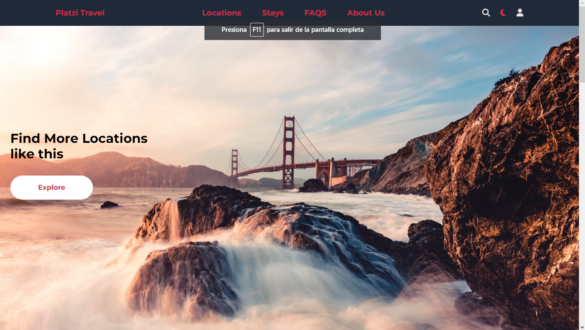
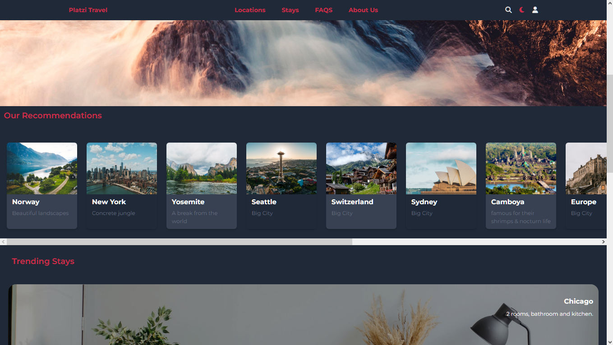
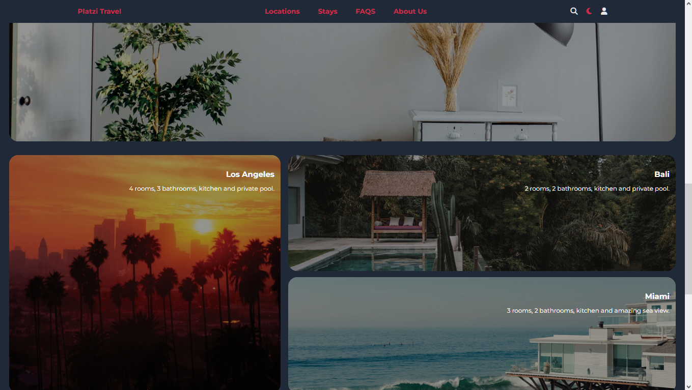
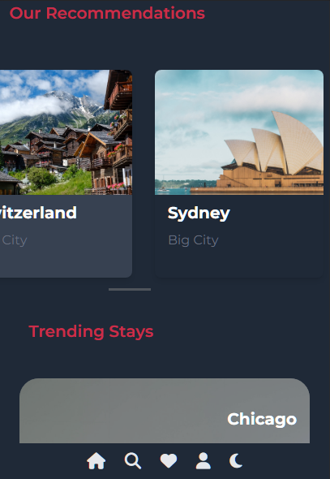
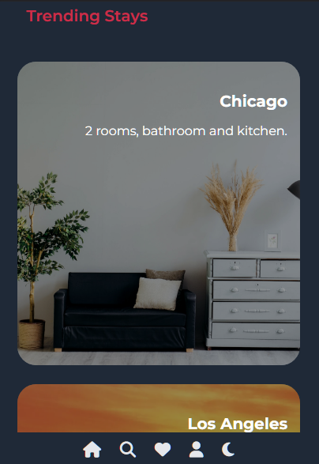

<p align="center">
  <a href="#features">Features</a> &#xa0; | &#xa0;
  <a href="#technologies">Technologies</a> &#xa0; | &#xa0;
  <a href="#requirements">Requirements</a> &#xa0; | &#xa0;
  <a href="#screenshots-about-platzi-travel">Screenshots</a> &#xa0; | &#xa0;
  <a href="#license">License</a> &#xa0; | &#xa0;
  <a href="#author" target="_blank">Author</a>
</p>

# Platzi Travel ✈ 🧳
Platzi Travel is a web page  made as part of a course at Platzi
utilizing  tailwindCss This project use Tailwind CSS with framework of CSS and explore the creation of components using vanilla JavaScript . 

The page show information about travels and Accommodation.The page design can be reached using utilities class of tailwindcss.

## Screenshots about Platzi Travel
### `Desktop`






### `Mobile`







## Requirements 

Before starting , you need to have [Git](https://git-scm.com) and [Node](https://nodejs.org/en/) installed.

`Run Locally`

Clone the project.

```bash
  git clone https://github.com/zyperr/platziTravel-tailwindCss.git
```

Go to the project directory.

```bash
  cd name-project
```

Install dependencies.

```bash
  npm install
```
Use live server to preview it.

If you want to immediately see on the browser every change you make, run.

```bash
npx tailwindcss -i ./src/css/index.css -o ./public/css/index.css --watch
```
Or u can create a script for that at package.json.

``` json
"scripts": {

// for dev
 "tw": "npx tailwindcss -i ./src/input.css -o ./build/css/style.css --watch"

 //to build for production
 "tw-build": "npx tailwindcss -i ./src/input.css -o ./build/css/style.css --minify"
},
```

## Features

- Light/dark mode toggle
- Ligh/dark mode keep it on **localStorage**
- Responsive design
- Mobile first


## Technologies

**Client:** Html, javascript, TailwindCSS

## License

This project is under license from, click for more details 👉🏽 [MIT](https://choosealicense.com/licenses/mit/)

## Author

made with love by [zyperr](https://www.github.com/zyperr)